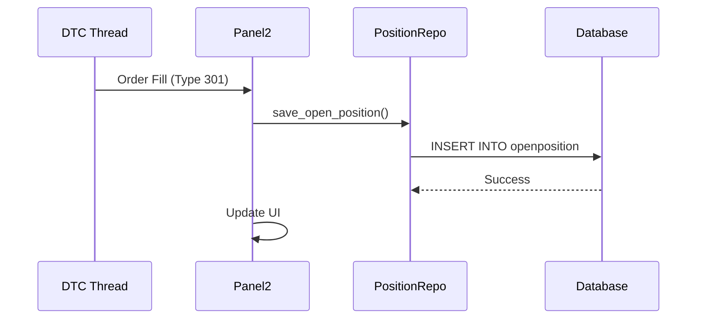

# Cleanup and Optimization Plan

**Date**: 2025-11-13
**Status**: Planned
**Context**: Post-Phases 1-6, Pre-Phase 7

---

## Overview

With the position state architecture complete (Phases 1-6), we can now identify and remove deprecated code, optimize performance, and prepare for production deployment.

---

## 1. Deprecated Code Removal

### 1.1 Panel2 JSON State Files (Partial Deprecation)

**Current State**:
- Panel2 uses JSON files for timer persistence (`state_SIM_.json`, `state_LIVE_120005.json`)
- Position state now in database (Phases 1-6)

**Action**:
- ✅ KEEP: Timer state in JSON (entry_time_epoch, heat_start_epoch)
  - Intentional design: timers should reset on restart
- ❌ REMOVE: Position state from JSON (entry_qty, entry_price, is_long)
  - Now stored in database

**Files to Clean**:
```python
# panels/panel2.py _save_state()
# Remove these fields from JSON:
# - entry_qty (deprecated - use database)
# - entry_price (deprecated - use database)
# - is_long (deprecated - use database)

# Keep these fields in JSON:
# - entry_time_epoch (session-scoped timer)
# - heat_start_epoch (session-scoped timer)
```

**Benefit**: Reduce confusion about state source of truth

### 1.2 Legacy TradeManager Direct Calls

**Current State**:
- Panel2.notify_trade_closed() has fallback to TradeManager
- Database position close is primary path

**Action**:
- Monitor usage of `_close_position_legacy()` in logs
- If unused after 1 week: remove fallback
- Keep only database close path

**Validation**:
```python
# Add metric to track fallback usage
log.warning("[DEPRECATED] TradeManager fallback used - investigate why DB path failed")
```

**Timeline**: 1 week monitoring → remove if 0 fallbacks

### 1.3 Unused StateManager Fields

**Candidate Fields**:
```python
# core/state_manager.py
self._state: dict[str, Any] = {}  # Generic dict - audit usage

# Check if these are still used:
self._state["balance"]  # vs self.sim_balance / self.live_balance
self._state["positions"]  # vs database
self._state["orders"]  # vs database
```

**Action**:
- Grep for `self._state` usage across codebase
- Identify unused keys
- Remove or migrate to typed fields

**Timeline**: 2-3 hours audit + cleanup

---

## 2. Performance Optimizations

### 2.1 Database Query Optimization

#### Current: Update Extremes Every 500ms

**Measurement**:
```python
# panels/panel2.py _on_csv_tick()
import time

start = time.time()
position_repo.update_trade_extremes(mode, account, price)
elapsed = time.time() - start

if elapsed > 0.05:  # 50ms threshold
    log.warning(f"[PERF] Slow DB update: {elapsed*1000:.1f}ms")
```

**If slow** (>50ms consistently):
- Add connection pooling tuning
- Batch updates (every 2-5 seconds instead of 500ms)
- Add debouncing (skip if <1s since last update)

**Target**: <10ms per update (non-blocking)

#### Database Indexes

**Verify indexes exist**:
```sql
-- OpenPosition queries by (mode, account)
CREATE INDEX idx_open_position_mode_account ON openposition(mode, account);

-- TradeRecord queries by mode and date
CREATE INDEX idx_trade_mode_date ON traderecord(mode, entry_time);
```

**Check with**:
```python
from data.db_engine import get_engine
engine = get_engine()
result = engine.execute("PRAGMA index_list('openposition')")
print(list(result))
```

### 2.2 Stats Cache Optimization

**Current**: 5-second TTL cache with threading.Lock

**Measurement**:
```python
# services/stats_service.py
# Add hit rate metric
_cache_hits = 0
_cache_misses = 0

# Log every 100 queries:
if (_cache_hits + _cache_misses) % 100 == 0:
    hit_rate = _cache_hits / (_cache_hits + _cache_misses)
    log.info(f"[STATS CACHE] Hit rate: {hit_rate:.1%}")
```

**If hit rate < 80%**:
- Increase TTL from 5s to 10s
- Add LRU eviction policy
- Pre-warm cache on startup

**Target**: >90% hit rate

### 2.3 GUI Update Batching

**Current**: Panel2 updates every cell individually

**Optimization**:
```python
# panels/panel2.py
def _refresh_all_cells(self):
    # Instead of:
    self.cell_qty.set_value(...)
    self.cell_price.set_value(...)
    self.cell_pnl.set_value(...)
    # ... 20+ individual updates

    # Do:
    self.setUpdatesEnabled(False)  # Batch updates
    try:
        self.cell_qty.set_value(...)
        self.cell_price.set_value(...)
        self.cell_pnl.set_value(...)
    finally:
        self.setUpdatesEnabled(True)  # Single repaint
```

**Benefit**: Reduce repaints from 20+ → 1

**Measurement**: Use Qt profiler
```python
from PyQt6.QtCore import QElapsedTimer
timer = QElapsedTimer()
timer.start()
self._refresh_all_cells()
print(f"Refresh took {timer.elapsed()}ms")
```

**Target**: <16ms (60 FPS)

---

## 3. Code Quality Improvements

### 3.1 Type Hints Coverage

**Current**: ~80% coverage (estimate)

**Goal**: 95%+ coverage

**Tools**:
```bash
# Run mypy with strict settings
mypy panels/panel2.py --strict

# Run pyright
pyright panels/panel2.py
```

**Focus Areas**:
- All function signatures
- All class attributes
- Return types for complex methods

### 3.2 Docstring Completeness

**Standard**: Google-style docstrings

**Audit**:
```python
# Check for missing docstrings
import ast

def find_missing_docs(filepath):
    with open(filepath) as f:
        tree = ast.parse(f.read())

    missing = []
    for node in ast.walk(tree):
        if isinstance(node, (ast.FunctionDef, ast.ClassDef)):
            if not ast.get_docstring(node):
                missing.append(node.name)

    return missing
```

**Target**: 100% of public methods documented

### 3.3 Unused Imports

**Tool**: autoflake
```bash
# Find unused imports
autoflake --check --remove-all-unused-imports panels/panel2.py

# Auto-fix
autoflake --in-place --remove-all-unused-imports panels/panel2.py
```

---

## 4. Testing Infrastructure

### 4.1 Test Coverage

**Current**: ~30% coverage (estimate)

**Measure**:
```bash
pytest --cov=data --cov=services --cov=core --cov-report=html
open htmlcov/index.html
```

**Target Coverage**:
- `data/position_repository.py`: >90%
- `services/position_recovery.py`: >80%
- `domain/position.py`: >95%
- `core/state_manager.py`: >70%

### 4.2 Test Categories

**Unit Tests** (fast, isolated):
- `tests/unit/test_position_domain.py` - Position model
- `tests/unit/test_position_repository.py` - Repository CRUD
- `tests/unit/test_state_manager.py` - State transitions

**Integration Tests** (slower, database):
- `tests/integration/test_phase7_position_lifecycle.py` - Full lifecycle
- `tests/integration/test_crash_recovery.py` - Recovery flow
- `tests/integration/test_mode_switching.py` - Mode isolation

**Performance Tests**:
- `tests/performance/test_db_writes.py` - DB update latency
- `tests/performance/test_gui_rendering.py` - UI responsiveness

### 4.3 CI/CD Integration

**GitHub Actions** (if using):
```yaml
# .github/workflows/tests.yml
name: Tests
on: [push, pull_request]
jobs:
  test:
    runs-on: ubuntu-latest
    steps:
      - uses: actions/checkout@v2
      - uses: actions/setup-python@v2
      - run: pip install -r requirements.txt
      - run: pytest tests/ --cov --cov-report=xml
      - uses: codecov/codecov-action@v2
```

---

## 5. Documentation

### 5.1 Architecture Diagrams

**Create**:
- Position lifecycle flow diagram (entry → open → close)
- Database schema diagram (OpenPosition ↔ TradeRecord)
- Thread interaction diagram (DTC thread ↔ GUI thread ↔ Database)

**Tool**: Mermaid (markdown-based)

**Example**:


### 5.2 API Reference

**Generate**:
```bash
# Use sphinx or pdoc
pdoc --html domain/position.py -o docs/api
pdoc --html data/position_repository.py -o docs/api
```

### 5.3 Deployment Guide

**Document**:
1. Database migration steps
2. Configuration requirements
3. Environment variables
4. Startup sequence
5. Monitoring and logging

---

## 6. Monitoring and Observability

### 6.1 Metrics to Track

**Position State**:
- Number of open positions (by mode)
- Average position duration
- Position recovery rate on startup

**Database**:
- Query latency (p50, p95, p99)
- Connection pool usage
- Transaction rollback rate

**Performance**:
- GUI render time (ms)
- DB update time (ms)
- Stats cache hit rate (%)

**Implementation**:
```python
# utils/metrics.py
class Metrics:
    _position_count = {"SIM": 0, "LIVE": 0}
    _query_times = []

    @classmethod
    def record_query_time(cls, elapsed_ms):
        cls._query_times.append(elapsed_ms)
        if len(cls._query_times) > 1000:
            cls._query_times.pop(0)

    @classmethod
    def get_p95_query_time(cls):
        if not cls._query_times:
            return 0
        sorted_times = sorted(cls._query_times)
        idx = int(len(sorted_times) * 0.95)
        return sorted_times[idx]
```

### 6.2 Logging Strategy

**Levels**:
- DEBUG: Database queries, cache hits/misses
- INFO: Position lifecycle events, mode changes
- WARNING: Fallback code paths, slow operations
- ERROR: Database failures, recovery errors

**Log Rotation**:
```python
# utils/logger.py
handler = RotatingFileHandler(
    "appv4.log",
    maxBytes=10*1024*1024,  # 10MB
    backupCount=5
)
```

---

## 7. Security Considerations

### 7.1 Input Validation

**Validate** all external inputs:
- DTC message fields (qty, price, symbol)
- User inputs (manual order entry)
- CSV feed data

**Sanitize** before database writes:
```python
def validate_quantity(qty: Any) -> int:
    """Validate and sanitize quantity."""
    try:
        qty_int = int(qty)
        if not (-1000 <= qty_int <= 1000):
            raise ValueError(f"Quantity out of range: {qty_int}")
        return qty_int
    except (TypeError, ValueError) as e:
        log.error(f"Invalid quantity: {qty}, error: {e}")
        return 0
```

### 7.2 SQL Injection Prevention

**Current**: SQLAlchemy ORM (safe by design)

**Verify**: No raw SQL with string interpolation
```bash
# Grep for dangerous patterns
grep -r "execute.*f\"" --include="*.py"
grep -r "execute.*%" --include="*.py"
```

**Should be**: Zero results (all queries use parameterized ORM)

---

## Priority Matrix

| Task | Impact | Effort | Priority | Timeline |
|------|--------|--------|----------|----------|
| Remove deprecated JSON state fields | Medium | Low | High | 1-2 hours |
| Add database query metrics | High | Low | High | 2-3 hours |
| Improve test coverage | High | High | Medium | 8-12 hours |
| GUI update batching | Medium | Low | Medium | 2-3 hours |
| Type hints to 95% | Low | Medium | Low | 4-6 hours |
| Documentation diagrams | Medium | Medium | Medium | 3-4 hours |

**Recommendation**: Focus on High Priority / Low Effort tasks first.

---

## Success Criteria

Cleanup complete when:
1. ✅ Deprecated code removed or marked
2. ✅ Database query metrics tracked
3. ✅ Test coverage >80% for critical paths
4. ✅ No performance regressions
5. ✅ All public APIs documented

---

**Status**: Plan complete, ready for execution
**Estimated Total Time**: 20-30 hours (spread over 1-2 weeks)
